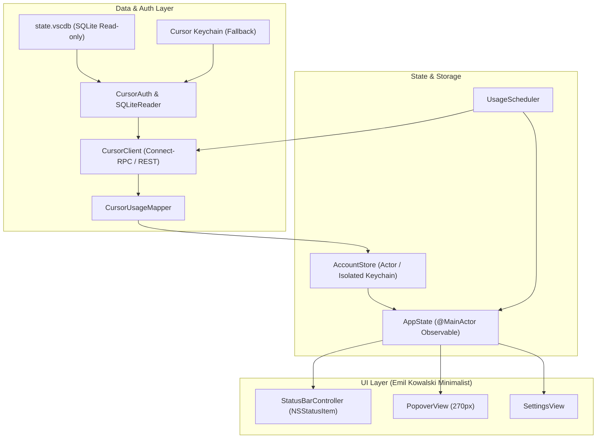

# CursorCompanion Implementation Plan

> **For agentic workers:** REQUIRED SUB-SKILL: Use superpowers:subagent-driven-development to implement this plan task-by-task. Steps use checkbox (`- [ ]`) syntax for tracking.

**Goal:** Build a native macOS menu bar app for monitoring both Cursor usage pools across multiple accounts with instant cache display and an ultra-clean Emil Kowalski signature UI.

**Architecture:** The project is structured into modular SwiftPM targets with Swift 6 strict concurrency (`CursorCompanionCore` for Auth, Client, Mapping, Store, Scheduler, and State; `CursorCompanionApp` for AppKit `NSStatusItem`/`NSPopover` and SwiftUI views; `CursorCompanionTests` for XCTest with JSON test fixtures). Multi-account session caching uses an isolated macOS Keychain namespace (`dev.cursorcompanion.account.<userID>`) with parallel polling.

**Architecture Diagram:**



**Tech Stack:** Swift 6, AppKit (`NSStatusItem`, `NSPopover`), SwiftUI, `libsqlite3`, macOS Keychain (`Security.framework`), XCTest.

**Spec:** [docs/superpowers/specs/2026-08-28-cursor-companion-design.md](file:///Users/puzzless/Desktop/cursor-companion/docs/superpowers/specs/2026-08-28-cursor-companion-design.md)

## Global Constraints
- Target platform: macOS 13.0+ (Ventura or newer)
- Swift version: Swift 6 with `-strict-concurrency=complete`
- No App Sandbox (non-sandboxed for read-only `state.vscdb` and Keychain access)
- Read-only to Cursor storage: Never write to Cursor's original `state.vscdb` or Keychain
- Keychain isolation: All CursorCompanion tokens stored exclusively under `dev.cursorcompanion.account.<userID>`
- Zero visual clutter: 270px width, 2px hairline tracks, `:active scale(0.97)` press states

---

### Task 1: Project Setup & Package Scaffolding

**Files:**
- Create: `Package.swift`
- Create: `Sources/CursorCompanionCore/Mapping/DomainModels.swift`
- Copy: `Tests/CursorCompanionTests/fixtures/*` (from `ref/cursorcompanion-test-fixtures/fixtures/`)
- Test: `Tests/CursorCompanionTests/FixturesLoadTests.swift`

**Interfaces:**
- Produces: `UsageSnapshot`, `CursorAccount`, `AccountStatus`, `UserSettings` models.

- [ ] **Step 1: Write the failing test**

```swift
// Tests/CursorCompanionTests/FixturesLoadTests.swift
import XCTest
@testable import CursorCompanionCore

final class FixturesLoadTests: XCTestCase {
    func test_fixtureResourceLoading() throws {
        guard let url = Bundle.module.url(forResource: "usage-summary-individual", withExtension: "json", subdirectory: "fixtures") ?? Bundle.module.url(forResource: "fixtures/usage-summary-individual", withExtension: "json") else {
            XCTFail("Fixture usage-summary-individual.json not found in module bundle")
            return
        }
        let data = try Data(contentsOf: url)
        XCTAssertFalse(data.isEmpty)
    }
}
```

- [ ] **Step 2: Run test to verify it fails**

Run: `swift test --filter FixturesLoadTests`
Expected: FAIL with "no such module / Package not configured"

- [ ] **Step 3: Write minimal implementation**

Create `Package.swift` with `CursorCompanionCore`, `CursorCompanionApp`, and `CursorCompanionTests` targets with `resources: [.copy("fixtures")]`. Copy all files from `ref/cursorcompanion-test-fixtures/fixtures/` into `Tests/CursorCompanionTests/fixtures/`.
Create `Sources/CursorCompanionCore/Mapping/DomainModels.swift` defining `UsageSnapshot`, `CursorAccount`, `AccountStatus`, `UserSettings`.

- [ ] **Step 4: Run test to verify it passes**

Run: `swift test --filter FixturesLoadTests`
Expected: PASS

- [ ] **Step 5: Commit**

```bash
git add Package.swift Sources/ Tests/
git commit -m "feat: setup SwiftPM package structure and domain models"
```

---

### Task 2: JWT & Auth Helpers (`JWTHelper` & `CursorAuth`)

**Files:**
- Create: `Sources/CursorCompanionCore/Auth/JWTHelper.swift`
- Create: `Sources/CursorCompanionCore/Auth/CursorAuth.swift`
- Create: `Tests/CursorCompanionTests/CursorAuthTests.swift`

**Interfaces:**
- Consumes: DomainModels
- Produces: `CursorAuth.userID(fromAccessToken:) -> String?`, `CursorAuth.sessionCookieValue(fromAccessToken:) -> String?`, `CursorAuth.needsRefresh(_:) -> Bool`, `CursorAuth.expirationDate(fromAccessToken:) -> Date?`.

- [ ] **Step 1: Write the failing test**

```swift
// Tests/CursorCompanionTests/CursorAuthTests.swift
import XCTest
@testable import CursorCompanionCore

final class CursorAuthTests: XCTestCase {
    func test_jwt_userIDFromSubWithPipe() {
        let token = TokenFixtures.valid
        XCTAssertEqual(CursorAuth.userID(fromAccessToken: token), "user_ACTIVE001")
    }

    func test_jwt_userIDFromSubWithoutPipe() {
        let token = TokenFixtures.noPipe
        XCTAssertEqual(CursorAuth.userID(fromAccessToken: token), "user_NOPIPE003")
    }

    func test_session_cookieValueFormat() {
        let token = TokenFixtures.valid
        let cookie = CursorAuth.sessionCookieValue(fromAccessToken: token)
        XCTAssertEqual(cookie, "user_ACTIVE001%3A%3A\(token)")
    }

    func test_needsRefresh_states() {
        XCTAssertFalse(CursorAuth.needsRefresh(TokenFixtures.valid))
        XCTAssertTrue(CursorAuth.needsRefresh(TokenFixtures.expiring))
        XCTAssertTrue(CursorAuth.needsRefresh(TokenFixtures.expired))
        XCTAssertTrue(CursorAuth.needsRefresh("not.a.jwt"))
    }
}
```

- [ ] **Step 2: Run test to verify it fails**

Run: `swift test --filter CursorAuthTests`
Expected: FAIL with "CursorAuth not found"

- [ ] **Step 3: Write minimal implementation**

Implement `JWTHelper.swift` for base64url decoding and JSON claim extraction (`sub`, `exp`), and `CursorAuth.swift` implementing `userID`, `sessionCookieValue`, and `needsRefresh`.

- [ ] **Step 4: Run test to verify it passes**

Run: `swift test --filter CursorAuthTests`
Expected: PASS

- [ ] **Step 5: Commit**

```bash
git add Sources/CursorCompanionCore/Auth/ Tests/CursorCompanionTests/CursorAuthTests.swift
git commit -m "feat: implement JWT parsing and session cookie construction"
```

---

### Task 3: Read-Only SQLite & Keychain Extractors

**Files:**
- Create: `Sources/CursorCompanionCore/Auth/SQLiteReader.swift`
- Create: `Sources/CursorCompanionCore/Auth/KeychainReader.swift`
- Create: `Tests/CursorCompanionTests/AuthExtractionTests.swift`

**Interfaces:**
- Produces: `SQLiteReader.readCursorAuth(databaseURL:) -> RawAuthData?`, `KeychainReader.readCursorTokens() -> RawAuthData?`, `CursorAuth.detectActiveSession() -> RawAuthData?`.

- [ ] **Step 1: Write the failing test**

```swift
// Tests/CursorCompanionTests/AuthExtractionTests.swift
import XCTest
@testable import CursorCompanionCore

final class AuthExtractionTests: XCTestCase {
    func test_selectionLogic_prefersKeychainWhenFreeAndMismatch() {
        let sqliteData = RawAuthData(accessToken: TokenFixtures.jwt(sub: "free_user", exp: Date().timeIntervalSince1970 + 3600), refreshToken: "ref1", membershipType: "free")
        let keychainData = RawAuthData(accessToken: TokenFixtures.jwt(sub: "pro_user", exp: Date().timeIntervalSince1970 + 3600), refreshToken: "ref2", membershipType: "pro")
        
        let chosen = CursorAuth.resolveSession(sqlite: sqliteData, keychain: keychainData)
        XCTAssertEqual(CursorAuth.userID(fromAccessToken: chosen?.accessToken ?? ""), "pro_user")
    }

    func test_selectionLogic_prefersSQLiteNormally() {
        let sqliteData = RawAuthData(accessToken: TokenFixtures.jwt(sub: "pro_user_sql", exp: Date().timeIntervalSince1970 + 3600), refreshToken: "ref1", membershipType: "pro")
        let keychainData = RawAuthData(accessToken: TokenFixtures.jwt(sub: "pro_user_kc", exp: Date().timeIntervalSince1970 + 3600), refreshToken: "ref2", membershipType: "pro")
        
        let chosen = CursorAuth.resolveSession(sqlite: sqliteData, keychain: keychainData)
        XCTAssertEqual(CursorAuth.userID(fromAccessToken: chosen?.accessToken ?? ""), "pro_user_sql")
    }
}
```

- [ ] **Step 2: Run test to verify it fails**

Run: `swift test --filter AuthExtractionTests`
Expected: FAIL with "RawAuthData / resolveSession not found"

- [ ] **Step 3: Write minimal implementation**

Implement `SQLiteReader` using `sqlite3_open_v2(..., SQLITE_OPEN_READONLY, ...)` querying `ItemTable`, `KeychainReader` using `SecItemCopyMatching`, and `CursorAuth.resolveSession`.

- [ ] **Step 4: Run test to verify it passes**

Run: `swift test --filter AuthExtractionTests`
Expected: PASS

- [ ] **Step 5: Commit**

```bash
git add Sources/CursorCompanionCore/Auth/ Tests/CursorCompanionTests/AuthExtractionTests.swift
git commit -m "feat: implement SQLite and Keychain credential extraction"
```

---

### Task 4: JSON Usage & Pool Mapping (`CursorUsageMapper`)

**Files:**
- Create: `Sources/CursorCompanionCore/Mapping/CursorUsageMapper.swift`
- Create: `Tests/CursorCompanionTests/CursorMappingTests.swift`

**Interfaces:**
- Consumes: JSON dictionaries
- Produces: `CursorUsageMapper.mapSummary(_ json: [String: Any]) throws -> UsageSnapshot`, `CursorUsageMapper.mapRequestUsage(_ json: [String: Any]) throws -> (used: Int, limit: Int)`.

- [ ] **Step 1: Write the failing test**

```swift
// Tests/CursorCompanionTests/CursorMappingTests.swift
import XCTest
@testable import CursorCompanionCore

final class CursorMappingTests: XCTestCase {
    private func loadFixture(_ name: String) throws -> [String: Any] {
        let url = Bundle.module.url(forResource: name, withExtension: "json", subdirectory: "fixtures")
            ?? Bundle.module.url(forResource: "fixtures/\(name)", withExtension: "json")
            ?? Bundle.module.url(forResource: name, withExtension: nil)
        let data = try XCTUnwrap(url.flatMap { try? Data(contentsOf: $0) }, "Fixture nicht gefunden: \(name)")
        return try XCTUnwrap(JSONSerialization.jsonObject(with: data) as? [String: Any])
    }

    func test_individual_mapsBothPools() throws {
        let json = try loadFixture("usage-summary-individual")
        let snapshot = try CursorUsageMapper.mapSummary(json)

        XCTAssertEqual(snapshot.cursorModelsPercent, 63.0, accuracy: 0.001)
        XCTAssertEqual(snapshot.otherModelsPercent, 41.2, accuracy: 0.001)
        XCTAssertEqual(snapshot.totalPercent, 52.4, accuracy: 0.001)
        XCTAssertNotNil(snapshot.cycleEnd)
    }

    func test_team_missingPercents_yieldsNoData_noCrash() throws {
        let json = try loadFixture("usage-summary-team")
        let snapshot = try CursorUsageMapper.mapSummary(json)

        XCTAssertNil(snapshot.cursorModelsPercent)
        XCTAssertNil(snapshot.otherModelsPercent)
        XCTAssertNotNil(snapshot.cycleEnd)
    }

    func test_partial_onlyOtherModels() throws {
        let json = try loadFixture("usage-summary-partial")
        let snapshot = try CursorUsageMapper.mapSummary(json)

        XCTAssertNil(snapshot.cursorModelsPercent)
        XCTAssertEqual(snapshot.otherModelsPercent, 18.5, accuracy: 0.001)
        XCTAssertNil(snapshot.totalPercent)
        XCTAssertNil(snapshot.cycleEnd)
    }

    func test_empty_allNoData_noCrash() throws {
        let json = try loadFixture("usage-summary-empty")
        _ = try? CursorUsageMapper.mapSummary(json)
    }

    func test_requestBasedFallback() throws {
        let json = try loadFixture("api-usage-requests")
        let requests = try CursorUsageMapper.mapRequestUsage(json)

        XCTAssertEqual(requests.used, 412)
        XCTAssertEqual(requests.limit, 500)
    }
}
```

- [ ] **Step 2: Run test to verify it fails**

Run: `swift test --filter CursorMappingTests`
Expected: FAIL with "CursorUsageMapper not found"

- [ ] **Step 3: Write minimal implementation**

Implement `CursorUsageMapper.swift` mapping `individualUsage.plan.autoPercentUsed`, `apiPercentUsed`, `totalPercentUsed`, ISO-8601 `billingCycleEnd`, and `api-usage-requests`.

- [ ] **Step 4: Run test to verify it passes**

Run: `swift test --filter CursorMappingTests`
Expected: PASS

- [ ] **Step 5: Commit**

```bash
git add Sources/CursorCompanionCore/Mapping/ Tests/CursorCompanionTests/CursorMappingTests.swift
git commit -m "feat: implement JSON usage and pool mapper"
```

---

### Task 5: Isolated Token Storage & Multi-Account Store (`AccountStore`)

**Files:**
- Create: `Sources/CursorCompanionCore/Store/SecureKeychainStorage.swift`
- Create: `Sources/CursorCompanionCore/Store/AccountMetadataStorage.swift`
- Create: `Sources/CursorCompanionCore/Store/AccountStore.swift`
- Create: `Tests/CursorCompanionTests/AccountStoreTests.swift`

**Interfaces:**
- Produces: `actor AccountStore`: `loadAccounts() -> [CursorAccount]`, `saveOrUpdateAccount(_ account: CursorAccount, tokens: AuthTokens)`, `updateTokens(accountID:tokens:)`, `removeAccount(accountID:)`, `updateLabel(accountID:newLabel:)`.

- [ ] **Step 1: Write the failing test**

```swift
// Tests/CursorCompanionTests/AccountStoreTests.swift
import XCTest
@testable import CursorCompanionCore

final class AccountStoreTests: XCTestCase {
    func test_addAndRetrieveAccount() async throws {
        let store = AccountStore(servicePrefix: "test.cursorcompanion")
        let account = CursorAccount(id: "user_test_123", label: "Work Account", isActive: true, plan: "Pro", snapshot: nil, status: .ok)
        let tokens = AuthTokens(accessToken: "tok_access", refreshToken: "tok_refresh")
        
        await store.saveOrUpdateAccount(account, tokens: tokens)
        let accounts = await store.loadAccounts()
        XCTAssertTrue(accounts.contains { $0.id == "user_test_123" })
        
        let loadedTokens = await store.getTokens(accountID: "user_test_123")
        XCTAssertEqual(loadedTokens?.accessToken, "tok_access")
    }
}
```

- [ ] **Step 2: Run test to verify it fails**

Run: `swift test --filter AccountStoreTests`
Expected: FAIL with "AccountStore not defined"

- [ ] **Step 3: Write minimal implementation**

Implement `SecureKeychainStorage` (managing `SecItemAdd`, `SecItemUpdate`, `SecItemCopyMatching`, `SecItemDelete`), `AccountMetadataStorage` using `UserDefaults`, and `AccountStore` actor.

- [ ] **Step 4: Run test to verify it passes**

Run: `swift test --filter AccountStoreTests`
Expected: PASS

- [ ] **Step 5: Commit**

```bash
git add Sources/CursorCompanionCore/Store/ Tests/CursorCompanionTests/AccountStoreTests.swift
git commit -m "feat: implement multi-account store with isolated keychain"
```

---

### Task 6: Network Client & 401 Refresh-Retry (`CursorClient`)

**Files:**
- Create: `Sources/CursorCompanionCore/Client/CursorEndpoints.swift`
- Create: `Sources/CursorCompanionCore/Client/CursorClient.swift`
- Create: `Tests/CursorCompanionTests/CursorClientTests.swift`

**Interfaces:**
- Consumes: `AccountStore`, `CursorAuth`, `CursorUsageMapper`
- Produces: `CursorClient`: `fetchUsageSummary(tokens:) async throws -> UsageSnapshot`, `refreshToken(refreshToken:) async throws -> AuthTokens`, `fetchAccountData(account:tokens:store:) async -> CursorAccount`.

- [ ] **Step 1: Write the failing test**

```swift
// Tests/CursorCompanionTests/CursorClientTests.swift
import XCTest
@testable import CursorCompanionCore

final class CursorClientTests: XCTestCase {
    func test_refreshTokenResponseParsing() throws {
        let url = try XCTUnwrap(Bundle.module.url(forResource: "oauth-token-refresh-response", withExtension: "json", subdirectory: "fixtures") ?? Bundle.module.url(forResource: "fixtures/oauth-token-refresh-response", withExtension: "json"))
        let data = try Data(contentsOf: url)
        let tokens = try CursorClient.parseRefreshResponse(data)
        XCTAssertEqual(tokens.accessToken, "jwt_access_token_NEW_MOCK_VALUE_abcdef123456")
    }
}
```

- [ ] **Step 2: Run test to verify it fails**

Run: `swift test --filter CursorClientTests`
Expected: FAIL with "CursorClient not found"

- [ ] **Step 3: Write minimal implementation**

Implement `CursorEndpoints.swift`, `CursorClient.swift` handling Connect-RPC Bearer calls, REST Cookie calls, token refresh via `POST api2.cursor.sh/oauth/token`, and automatic retry on 401.

- [ ] **Step 4: Run test to verify it passes**

Run: `swift test --filter CursorClientTests`
Expected: PASS

- [ ] **Step 5: Commit**

```bash
git add Sources/CursorCompanionCore/Client/ Tests/CursorCompanionTests/CursorClientTests.swift
git commit -m "feat: implement Cursor API client with refresh and retry logic"
```

---

### Task 7: Background Scheduler & Observable State (`AppState`)

**Files:**
- Create: `Sources/CursorCompanionCore/Scheduler/UsageScheduler.swift`
- Create: `Sources/CursorCompanionCore/State/AppState.swift`
- Create: `Tests/CursorCompanionTests/AppStateTests.swift`

**Interfaces:**
- Produces: `@MainActor class AppState: ObservableObject`, `UsageScheduler`.

- [ ] **Step 1: Write the failing test**

```swift
// Tests/CursorCompanionTests/AppStateTests.swift
import XCTest
@testable import CursorCompanionCore

final class AppStateTests: XCTestCase {
    @MainActor
    func test_initialCacheLoadUnderOneSecond() async {
        let store = AccountStore(servicePrefix: "test.cursorcompanion.speed")
        let appState = AppState(store: store)
        let start = Date()
        await appState.loadCachedAccounts()
        let duration = Date().timeIntervalSince(start)
        XCTAssertLessThan(duration, 1.0, "Kaltstart-Ladezeit muss unter 1 Sekunde liegen")
    }
}
```

- [ ] **Step 2: Run test to verify it fails**

Run: `swift test --filter AppStateTests`
Expected: FAIL with "AppState not found"

- [ ] **Step 3: Write minimal implementation**

Implement `UsageScheduler.swift` with periodic `Task` polling and wake notification observation, and `AppState.swift` (`@MainActor`) managing accounts, active/selected accounts, and instant cache loading.

- [ ] **Step 4: Run test to verify it passes**

Run: `swift test --filter AppStateTests`
Expected: PASS

- [ ] **Step 5: Commit**

```bash
git add Sources/CursorCompanionCore/Scheduler/ Sources/CursorCompanionCore/State/ Tests/CursorCompanionTests/AppStateTests.swift
git commit -m "feat: implement background scheduler and observable app state"
```

---

### Task 8: AppKit Status Item & Popover Controller

**Files:**
- Create: `Sources/CursorCompanionApp/App/StatusBarController.swift`
- Create: `Sources/CursorCompanionApp/App/AppDelegate.swift`
- Create: `Sources/CursorCompanionApp/App/CursorCompanionApp.swift`

**Interfaces:**
- Consumes: `AppState`
- Produces: Native `NSStatusItem` in system menubar and `NSPopover` with `NSHostingView`.

- [ ] **Step 1: Write implementation for StatusBarController**

Implement `StatusBarController` hosting SwiftUI `MenuBarLabelView` in the status item button and managing `NSPopover` with `NSHostingView(rootView: PopoverView(appState: appState))`.

- [ ] **Step 2: Verify compilation**

Run: `swift build`
Expected: Build succeeds with 0 warnings.

- [ ] **Step 3: Commit**

```bash
git add Sources/CursorCompanionApp/App/
git commit -m "feat: implement AppKit status bar controller and popover host"
```

---

### Task 9: Emil Kowalski Minimalist SwiftUI Views

**Files:**
- Create: `Sources/CursorCompanionApp/Views/MenuBarLabelView.swift`
- Create: `Sources/CursorCompanionApp/Views/PopoverView.swift`
- Create: `Sources/CursorCompanionApp/Views/MetricBlockView.swift`
- Create: `Sources/CursorCompanionApp/Views/StateViews.swift`
- Create: `Sources/CursorCompanionApp/Views/SettingsView.swift`

**Interfaces:**
- Consumes: `AppState`
- Produces: 270px compact popover, 2px hairline progress bars, tactile press states, settings window.

- [ ] **Step 1: Write SwiftUI Views adhering to Emil Kowalski minimalist design**

Implement `PopoverView` (270px width, 16px padding, `#121212` background, `#242424` border), `MetricBlockView` (2px hairline track in `#222222`, `#10B981` / `#F59E0B` fills, tabular figures), `MenuBarLabelView`, `StateViews`, and `SettingsView`.

- [ ] **Step 2: Verify compilation and tests**

Run: `swift test`
Expected: All tests pass.

- [ ] **Step 3: Commit**

```bash
git add Sources/CursorCompanionApp/Views/
git commit -m "feat: implement Emil Kowalski signature minimalist SwiftUI views"
```

---

### Task 10: Full End-to-End Verification & Release Build

**Files:**
- Modify: `README.md`
- Create: `build_app.sh`

- [ ] **Step 1: Run all unit tests**

Run: `swift test`
Expected: 100% tests passing.

- [ ] **Step 2: Build release binary & bundle**

Run: `swift build -c release`
Expected: Build successful.

- [ ] **Step 3: Update documentation**

Update `README.md` with features, setup instructions, OpenUsage MIT attribution, and build commands.

- [ ] **Step 4: Commit**

```bash
git add README.md build_app.sh
git commit -m "docs: finalize README and build script for v1.0 release"
```
